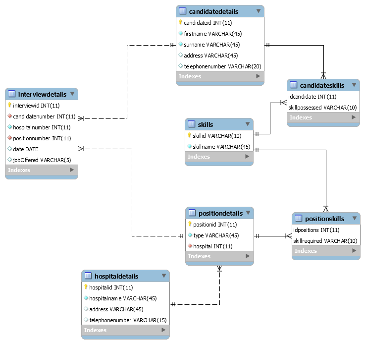

# Database-for-Hospital-Recruitment
### Databases & Information Systems COMP20070, UCD BSc. Computer Science 2nd Year
Created a database using MySQL that tackles the scenario “Hospitals advertise positions which require skills. Candidates may be invited to interviews for the positions”. Used conceptual and logical design methodology to visualise the database. I then performed 11 queries on the database.

## Getting Started
There are many ways to run sql files.  
My recommendation is to:   
- Install [Workbench.](https://dev.mysql.com/downloads/workbench/)
- Download and open the file **Project.sql**.
- Now you can create tables/run queries as you wish.

## Contents
- **Project.sql:**: This is the file containing the SQL script that creats the database and queries it.
- **Documentation.sql:** PDF containing the explanation of the database.
- **Tables:** This is folder contains 7 *.csv* files, each containing one of the tables created in the SQL script.
- **ERR.png:** Image of the Entity Relationship Diagram which shows entities (tables) in a database and relationships between tables within that database.

## About the Database
- I created a databasethat tackles the scenario “Hospitals
advertise positions which require specific skills (e.g., nursing, administrative, etc.). Candidates may be invited to interviews for the positions”.  
- I created a list of main concepts (tables) and used forgien keys to link them.  
- Once the dataframe was created, I performed 11 queries on it as can be seen towards the end of the script.
- Below is a summary of the tables and how they are linked (ER Diagram).

## Authors
- Ahmed Jouda

## Acknowledgements
- Assoc Professor Michela Bertolotto
